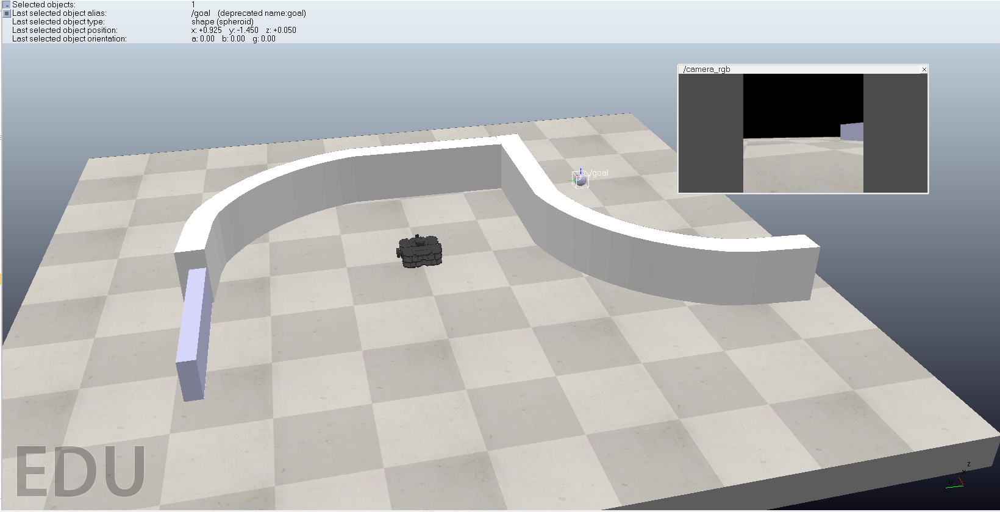
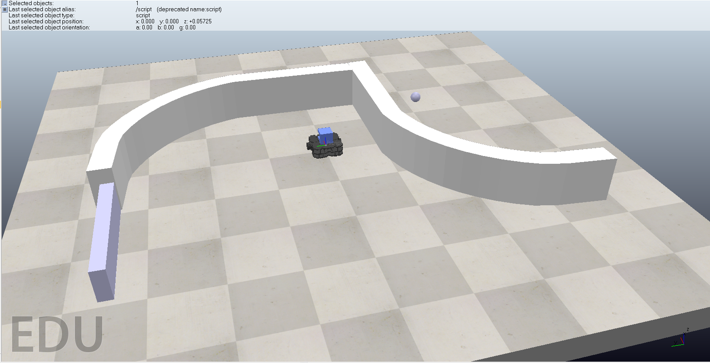
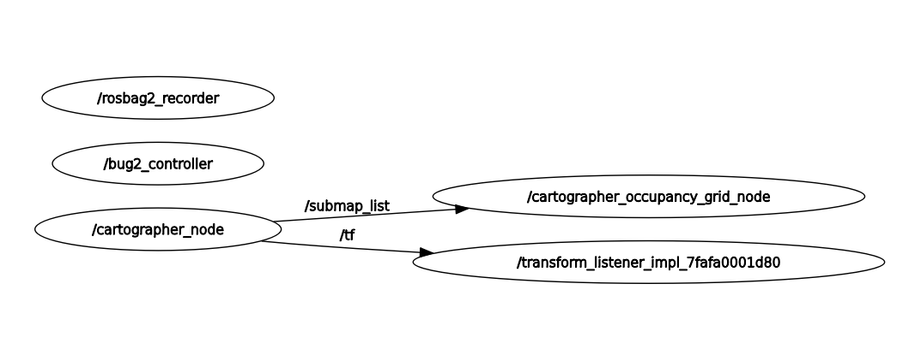
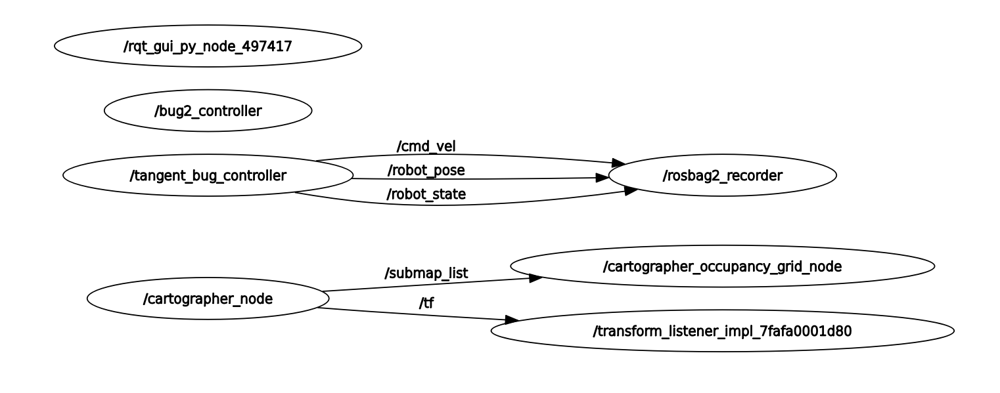
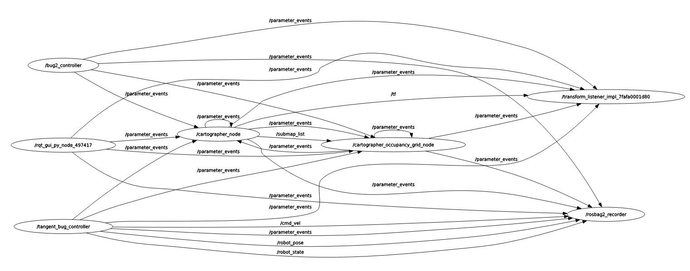

# Navegação Reativa com Algoritmos Bug em ROS 2 e CoppeliaSim

Este projeto apresenta a implementação de algoritmos de navegação reativa para um robô TurtleBot3, utilizando ROS 2, o simulador CoppeliaSim e a linguagem Python. O objetivo principal é capacitar o robô a navegar de um ponto inicial a um ponto de destino em um ambiente com obstáculos estáticos, utilizando os algoritmos **Bug 2** e **Bug Tangente**.

## Algoritmos Implementados

- **Bug 2:** O robô segue em linha reta até o objetivo (linha M-line). Quando encontra um obstáculo, percorre sua borda até reencontrar a linha em um ponto mais próximo do destino do que o ponto de colisão. Se não houver tal ponto, o objetivo é considerado inalcançável.
- **Bug Tangente:** Utiliza dados de sensores de alcance (como LIDAR) para estimar a distância mínima até o objetivo. Com isso, o robô decide dinamicamente se deve seguir direto ou contornar o obstáculo, escolhendo sempre o caminho que parece mais promissor. Isso normalmente gera trajetórias mais curtas que no Bug 2.

## Ambiente de Simulação

O cenário foi construído no simulador CoppeliaSim, contendo um robô TurtleBot3 (versão Waffle) e múltiplos obstáculos estáticos, incluindo ao menos um obstáculo côncavo para desafiar a lógica de navegação.

#### Cenário para o Bug 2

#### Cenário para o Bug Tangente

## Arquitetura do Sistema

- **Simulador:** CoppeliaSim
- **Framework de Robótica:** ROS 2
- **Linguagem:** Python
- **Comunicação Simulador-ROS:** API Remota ZMQ do CoppeliaSim
- **Robô:** TurtleBot3 (simulado)

O nó principal em ROS 2 atua como o controlador central. Ele se conecta à simulação via ZMQ, lê os dados dos sensores e a pose do robô, processa a lógica do algoritmo Bug e envia comandos de velocidade diretamente para as juntas das rodas do robô. Para fins de depuração e avaliação, o nó também publica os dados de pose, velocidade e estado em tópicos ROS 2.

## Visualização dos Nós (Node Graphs)

Os diagramas abaixo, gerados com a ferramenta `rqt_graph` do ROS 2, mostram os nós e tópicos ativos durante a execução de cada algoritmo. Eles ilustram como nossos nós controladores se comunicam com o ecossistema ROS, publicando dados para serem gravados pelo `rosbag2_recorder`.

#### Bug 2 Node Graph

#### Bug Tangente Node Graph

#### Visão do Sistema Completo
Este gráfico mostra uma visão mais complexa do sistema, com ambos os nós (`bug2_controller` e `tangent_bug_controller`) e o nó `rosbag2_recorder` ativos.

## Estrutura do Código

- **`reactive_nav/bug2_controller.py`**: Contém a classe principal `Bug2Controller`, que implementa a máquina de estados (GO_TO_GOAL, WALL_FOLLOW) e toda a lógica de sensoriamento e atuação para o algoritmo Bug 2. Utiliza sensores de proximidade simples para detecção de obstáculos.

- **`reactive_nav/tangent_bug_controller.py`**: Contém a classe `TangentBugController`. Similar ao Bug 2, mas implementa a lógica do Bug Tangente. Utiliza um array de dados de um sensor LIDAR para tomar decisões mais inteligentes, verificando constantemente se o caminho direto para o objetivo está livre, resultando em uma navegação mais eficiente.

- **`models/`**: Contém o modelo de obstáculo utilizado e uma cena do modelo simulado do turtlebot.

- **`scenes/`**: Contém o arquivo `.ttt` das cenas utilizadas no CoppeliaSim.

## Autores

- **Rogério Filho**
- **Renalvo Alves**