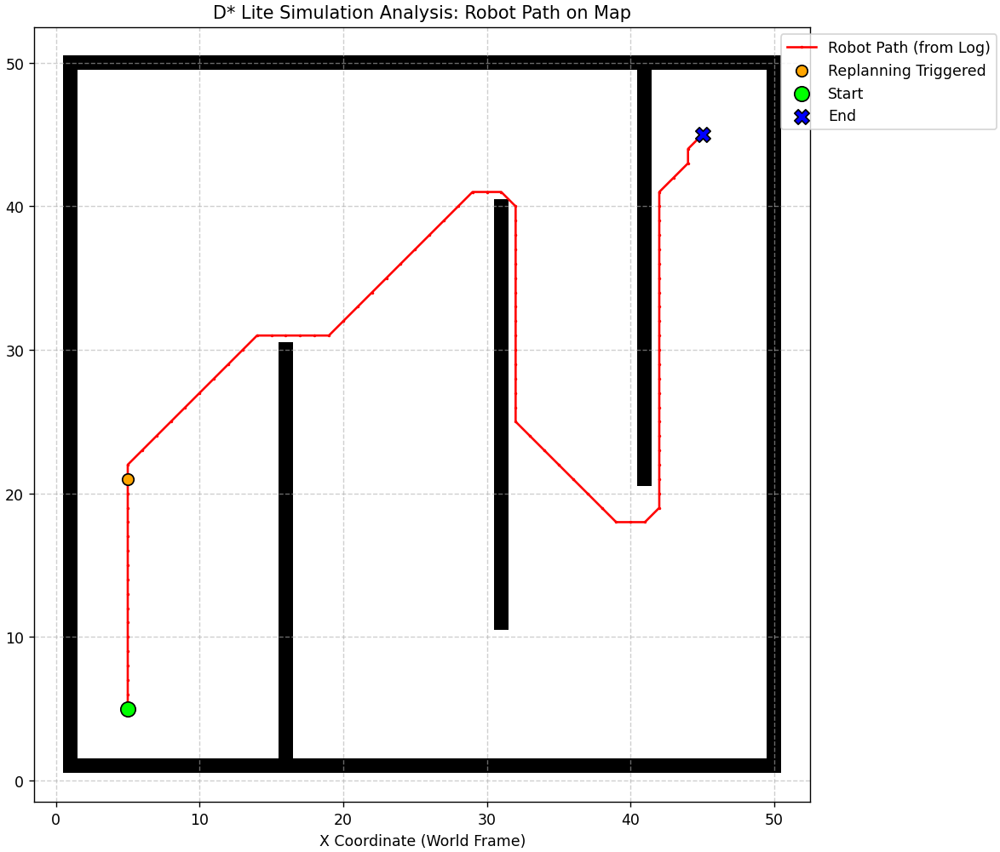

# Navegação Baseada em Mapa

## Descrição

A atividade foi desenvolvida em Python para implementar e simular algoritmos de navegação baseados em mapa. A implementação foi inspirada no repositório PythonRobotics.

O objetivo foi implementar dois algoritmos de navegação:

  * D\* Lite
  * RRT

As simulações utilizam mapas com obstáculos fixos, passagens estreitas e obstáculos móveis.

## Estrutura dos Scripts para o D* Lite

  * `d_star_lite.py`: implementação principal do algoritmo D\* Lite, incluindo simulação e geração de logs.
  * `simulation_log.json`: arquivo gerado pelo D\* Lite contendo o registro dos estados da simulação (equivalente a um rosbag).
  * `simulation_map.pgm`: mapa gerado a partir da simulação, usado como base para visualização.
  * `ver_log.py` e `ver_mapa.py`: scripts para carregar e visualizar o mapa e o log da simulação.

## Dados Gerados

Durante a execução do algoritmo principal, é gerado um arquivo JSON (`simulation_log.json`) que representa o rosbag da simulação.

Esse arquivo contém:

  * Posições (x, y) do robô ao longo da navegação
  * Estados do robô (por exemplo: "MOVING", "REPLANNING\_DETECTED", "GOAL\_REACHED")
  * Custos e métricas internas do algoritmo
  * Tempo de execução e eventos de atualização do mapa

Além disso, é gerado um arquivo de mapa (`simulation_map.pgm`) representando o ambiente com os obstáculos utilizados na simulação.

## Visualizações

Os scripts de visualização (`ver_log.py` e `ver_mapa.py`) utilizam `matplotlib` para exibir o mapa e sobrepor a trajetória do robô e os eventos registrados no log.

## Resultados

### D\* Lite

### RRT

## Como Executar

1.  Execute `python d_star_lite.py` para gerar o mapa (.pgm) e o log (.json).
2.  Execute `python ver_log.py` para visualizar o mapa com a trajetória do robô.